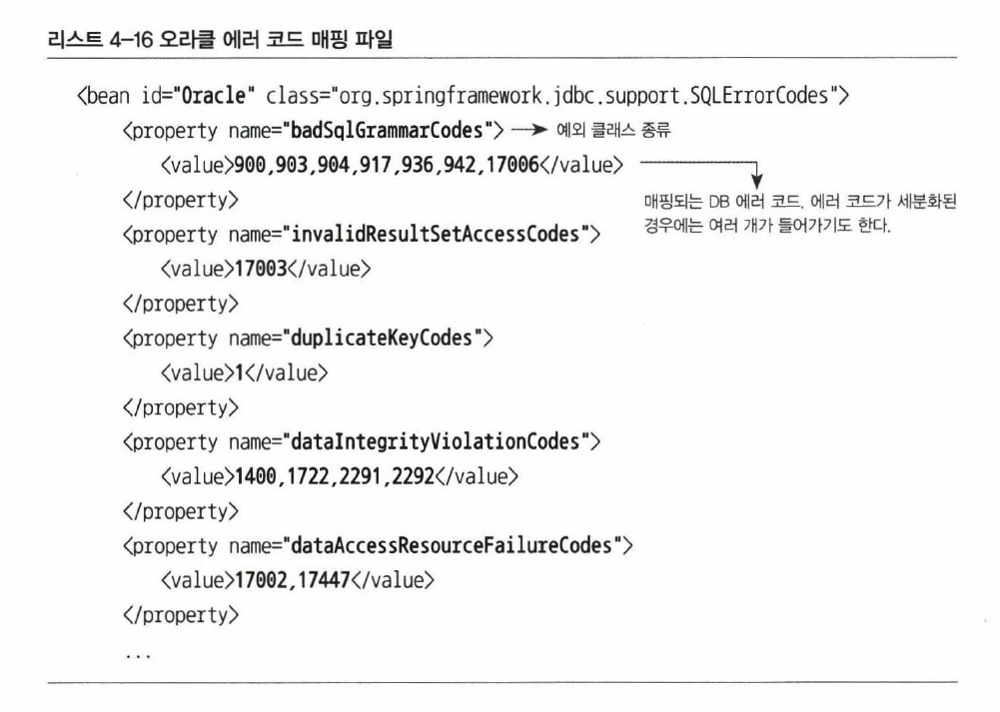

# 예외 전환

예외 전환의 목적은 두 가지로 나뉜다.

- 런타임 예외로 포장해서 굳이 필요하지 않은 catch/throws를 줄인다.

- 로우레벨의 예외를 좀 더 의미있고 추상화된 예외로 바꾼다.

`DataAccessException` 은 런타임 예외로 `SQLException`을 포장해서 복구 불가능한 것을 애플리케이션 레벨에서는 신경쓰지 않도록 해준다.

또, `SQLException`에서 다루기 힘든 상세한 예외 정보를 의미 있고 일관성 있는 예외로 전환해서 추상화 한다.

## JDBC의 한계

JDBC는 DB 접근 방식을 추상화한 API를 정의해서 각기 다른 DB 업체들이 표준에 맞게 드라이버를 제공하도록 해준다. 하지만 여전히 자유롭게 사용할 수 없는 부분이 있다.

### 비표준 SQL

SQL은 어느정도 표준화되어있지만 비표준 문법과 기능도 존재한다. 대용량 데이터 처리의 성능을 높이기 위해 최적화 기법을 적용하는 등 비표준 SQL을 사용하게 되면 특정 DB에 종속된다.

### 호환성 없는 SQLException의 DB 에러 정보

DB가 다르면 에러와 종류와 원인도 제각각이다. JDBC는 이런 다양한 에러를 `SQLException` 하나에 묶어버린다. `e.getErrorCode()` 로 고유의 정보를 확인할 수 있지만 DB에 따라 정확하지 않은 값이 들어가있는 경우도 있다.

따라서 SQL 상태 코드를 믿고 결과를 파악하는 것은 위험하며 `SQLException`만으로 DB에 독립적인 코드를 작성하는 것은 불가능하다.

## DB 에러 코드 매핑

`SQLException`에 담긴 상태 코드는 신뢰성이 없지만, DB 업체별로 제공하는 전용 에러코드는 좀 더 정확하다. 이 에러 코드를 참고해서 예외 원인을 파악할 수 있다.

스프링은 `DataAccessException` 이라는 런타임 예외를 정의하고 있는데 `SQLException`을 대체할 수 있으며 `BadSqlGrammarException` 등 세분화 된 서브 클래스를 제공한다.



하지만 DB 마다 에러 코드가 제각각이므로 위와 같이 분류해서 스프링이 정의한 예외 클래스와 매핑한 테이블을 만들어둔다.

JdbcTemplate은 `SQLException`을 단지 `DataAccessException`으로 포장하는 것이 아니라 각자의 에러 코드를 그 아래의 클래스 중 하나로 매핑해준다.

이렇게 DB별로 미리 준비해둔 리스트를 참고해서 적절한 예외 클래스를 선택하기 때문에 DB가 달라져도 같은 종류의 에러는 동일한 예외를 받을 수 있다.



```java
public class UserDao {
    // 이제 따로 중복 키 에러를 분류할 필요가 없다.
    // DB를 변경하더라도 JdbcTemplate을 이용해 동일한 예외를 던져준다.
    public void add() throws DuplicateKeyException {
        // JDBCTemplate을 이용해 User를 add하는 코드
    }
}
```



```java
public class DuplicateUserIdException extends RuntimeException {
    public DuplicateUserIdException(Throwable cause) {
        super(cause);
    }
}

public class UserDao {
    public void add() throws DuplicateUserIdException {
        try {
        }
        catch(SQLException e) {
            if(e.getErrorCode() == MysqlErrorNumbers.ER_DUP_ENTRY)
                // 예외 전환
                throw new DuplicateUserIdException(e);
            else
                // 예외 포장
                throw new RuntimeException(e);
        }
    }
}
```



에러가 발생했을 때 애플리케이션에서 직접 정의한 예외를 발생시킬 수도 있다. 이때는 아래처럼 예외를 전환해주면 된다.



```java
public class UserDao {
    // DuplicateUserIdException이라는 애플리케이션 레벨의 체크 예외로 전환해 던진다.
    public void add() throws DuplicateUserIdException {
        try {
            // JDBCTemplate을 이용해 User를 add하는 코드
        }
        catch(DuplicateKeyException e) {
            // 로그를 남기는 등의 필요한 작업 코드

            // 예외를 전환할 때는 원인이 되는 예외를 중첩하는 것이 좋다.
            throw new DuplicateUserIdExcepton(e);
        }
    }
}
```



```java
public class UserDao {
    public void add() throws DuplicateKeyException {
        // JDBCTemplate을 이용해 User를 add하는 코드
    }
}
```



`DuplicateKeyException`을 `DuplicateUserIdExcepton`으로 전환해 던지고 있다.

## DataAccessException의 계층 구조

`DataAccessException`은 의미가 같은 예외라면 JDBC든, Hibernate든 일관된 예외가 나오도록 만들어준다. 데이터 액세스 기술에 독립적으로 추상화된 예외를 제공하는 것이다.

### DAO 인터페이스와 구현의 분리