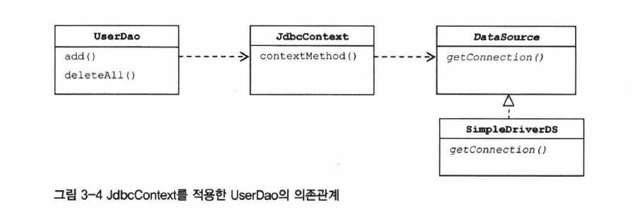
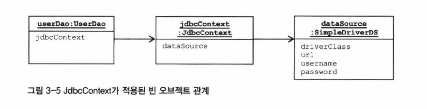
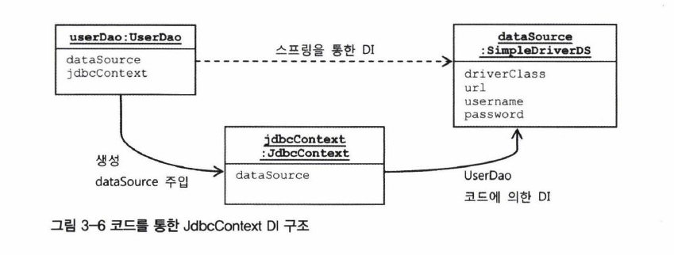

# 컨텍스트와 DI

전략 패턴으로 보면 구조는 다음과 같다.

* 클라이언트: UserDao의 add\(\), deleteAll\(\) 등의 메소드
* 전략: 익명 내부 클래스로 만들어지는 내용
* 컨텍스트: DB 커넥션을 만드는 큰 흐름인 jdbcContextWithStatementStrategy\(\) 메소드

컨텍스트 메소드는 `UserDao`에 있는 `PreparedStatement`를 실행하는 메소드라면 다 같이 공유할 수 있다. 다른 DAO에서도 사용할 수 있도록 `jdbcContextWithStatementStrategy()`를 UserDao 클래스 밖으로 독립시켜보자.

## 클래스 분리

분리할 클래스의 이름은 `JdbcContext` 라고 하자. `UserDao`에 있던 컨텍스트 메소드를 `workWithStatementStrategy()`로 옮긴다.

```java
package springbook.user.dao;
...
public class jdbcContext {
    private DataSource dataSource;

    // 클래스를 분리하면서 이제 datasource는 UserDao가 아니라
    // JdbcContext 클래스에서 필요하므로
    // dataSource 타입의 빈을 DI 받을 수 있게 해둔다.
    public void setDataSource(DataSource dataSource) {
        this.dataSource = dataSource;
    }

    // 기존의 컨텍스트를 옮겨오면서 이름만 변경했다.
    public void workWithStatementStrategy(StatementStrategy stmt) throws SQLException {
        Connection c = null;
        PreparedStatement ps = null;

        try {
            c = this.dataSource.getConnection();
            ps = stmt.makePreparedStatement(c);
            ps.executeUpdate();
        } catch (SQLException e) {
            throw e;
        } finally {
            if (ps != null) { try { ps.close(); } catch (SQLException e) {} }
            if (c != null) { try {c.close(); } catch (SQLException e) {} }
        }
    }
}
```

그럼 `UserDao`는 이렇게 바뀐다.



```java
public class UserDao {
    private JdbcContext jdbcContext;

    // 위에서 만든 JdbcContext 오브젝트를 DI 받는다.
    public void setJdbcContext(JdbcContext jdbcContext) {
        this.jdbcContext = jdbcContext;
    }   

    public void add(final User user) throws SQLException {
        // DI 받은 jdbcContext의 컨텍스트 메소드를 사용하도록 변경한다.
        this.jdbcContext.workWithStatementStrategy(
            new StatementStrategy() {
                ...
         });
    }

    public void deleteAll() throws SQLException {
        this.jdbcContext.workWithStatementStrategy(
            new StatementStrategy() {
                ...
            }
        );
    }
    ...
}
```



```java
public class UserDao {
    ...
    public void setDataSource(DataSource dataSource) {
            this.dataSource = dataSource;
        }

    public void add(final User user) throws SQLException {
        jdbcContextWithStatementStrategy(
            new StatementStrategy() {
                ...
         });
    }

    public void deleteAll() throws SQLException {
        jdbcContextWithStatementStrategy(
            new StatementStrategy() {
                ...
            }
        );
    }
    ...
}
```



이제 `UserDao`는 `JdbcContext`에 의존하고 있다. 그런데 `JdbcContext`는 `DataSource`와는 달리 인터페이스가 아니라 구체적인 구현 클래스다.

스프링의 DI는 기본적으로 인터페이스를 사이에 두고 의존 클래스를 바꿔서 사용하는 게 목적이다. 하지만 JdbcContext는 독립적으로 JDBC 컨텍스트를 제공해줄 뿐 그 구현 방법이 바뀔 가능성은 없다. 그래서 인터페이스로 구현하지 않고 DI를 적용하는 특별한 구조가 된다.



그림으로 나타내면 위와 같다. 인터페이스 없이 JdbcContext가 추가된 의존 관계를 나타내고 있다.



스프링의 빈 설정은 클래스 레벨이 아니라, 런타임 시에 오브젝트 레벨에서 생기는 의존관계에 따라 정의된다. 기존에는 userDao 빈이 dataSource 빈을 직접 의존했지만 이제 그 사이에 jdbcContext 빈이 끼게 되었다.

## JdbcContext의 특별한 DI

UserDao는 인터페이스를 거치지 않고 바로 JdbcContext 클래스를 사용하고 있다. 런타임 시에 DI로 외부에서 오브젝트를 주입하고 있긴 하지만 클래스 레벨에서 의존 관계가 결정되며 의존 오브젝트의 구현 클래스를 변경할 수 없다.

의존 관계 주입을 충실히 따르자면 인터페이스를 사이에 두고 클래스 레벨에서는 의존 관계가 고정되지 않다가 런타임 시에 의존할 오브젝트의 관계를 다이내믹하게 주입해야 한다.

따라서 인터페이스를 사용하지 않았다면 엄밀히 말해서 완전한 DI라고 볼 수는 없다. 그러나 스프링의 DI는 넓게 보면 객체가 만들어지고, 관계를 설정하고, 제어권을 제거해 외부로 위임한다는 IoC 개념을 포함한다.

그런 의미에서 JdbcContext를 UserDao 객체에서 사용하게 주입한 것은 DI의 기본을 따르고 있다고 볼 수 있다.

### 인터페이스를 사용하지 않고도 DI를 고집하는 이유

#### JdbcContext를 싱글톤 빈으로 관리할 수 있다

JdbcContext는 그 자체로 변경 가능성이 있는 상태 정보를 갖고 있지 않다. 내부에 사용할 dataSource라는 인스턴스 변수는 있지만 이것은 읽기 전용이므로 싱글톤이 되어도 상관없다.

JdbcContext는 JDBC 컨텍스트 메소드를 제공해주는 일종의 서비스 오브젝트로서 기능하고 있으므로 싱글톤으로 등록한 뒤 여러 오브젝트에서 공유하는 것이 효율적이다.

#### JdbcContext가 DI로 다른 빈에 의존하고 있다

이 두 번째 이유가 중요하다. JdbcContext는 dataSource 프로퍼티를 통해 DataSource 오브젝트를 주입받는다.

DI를 받으려면 주입되는 곳과 주입 받는 곳 둘 다 스프링 빈으로 등록되어야 한다. 스프링이 생성하고 관리하는 IoC 대상이어야 DI에 참여할 수 있기 때문이다.

### DI에 인터페이스를 사용하지 않는 이유

인터페이스가 없다는 건 UserDao와 JdbcContext가 긴밀하고 강하게 연결되어 있다는 의미다. 항상 이 둘은 함께 사용되어야 하는 것이다.

JDBC 대신 JPA나 하이버네이트를 쓴다면 JdbcContext를 통째로 바구는 방법밖에 없다. 테스트에서도 다른 구현으로 대체해서 사용할 이유가 없다. 따라서 굳이 인터페이스로 만들 이유가 없는 것이다.

단, 이렇게 클래스를 바로 사용하는 구성은 가장 마지막에 고려하는 게 좋다. 귀찮다고 인터페이스를 만들지 않는 것은 안된다.

## 코드를 이용하는 수동 DI

JdbcContext를 스프링 빈으로 등록하는 대신 UserDao 내부에서 직접 DI 하는 방법도 있다. 이 경우에 싱글톤으로 만드는 건 포기해야 한다. DAO 메소드가 호출될 때마다 JdbcContext 오브젝트를 갖고 있는 것이다.

DAO 메소드 마다 만드는 게 아니라 DAO 개수만큼만 만들면 되고, JdbcContext에 상태 정보도 없으므로 메모리에 부담이 가지는 않는다. 자주 만들었다가 제거하는 것도 아니기 때문에 GC에도 영향이 없다.

빈으로 등록하지 않았다면 다른 존재가 JdbcContext를 생성하고 초기화 해야 한다. JdbcContext를 직접 사용하는 UserDao가 담당하면 된다.

그런데 DI를 받으려면 서로 빈으로 등록되어 있어야 한다고 했다. 우리는 빈으로 만들지 않으므로 UserDao에 DI까지 맡기면 된다. 오브젝트를 만들고 수정자 메소드로 주입해주는 것이다.



그림으로 보면 위와 같다.

1. 스프링 빈에 userDao와 dataSource만 빈으로 정의한다. 
2. userDao 빈에 dataSource를 주입받는다.
3. UserDao는 JdbcContext 오브젝트를 만든다.
4. 만들면서 DI 받은 DataSource를 JdbcContext의 수정자 메소드로 주입한다.
5. 만들어진 JdbcContext 오브젝트는 UserDao의 인스턴스 변수에 저장해 사용한다.



```java
public class UserDao {
    private DataSource dataSource;
    private JdbcContext jdbcContext;

    // 수정자 메소드로 클라이언트가 직접 JdbcContext를 생성하고 DI 한다.
    public void setDataSource(DataSource dataSource) {
        // JdbcContext 생성
        this.jdbcContext = new JdbcContext();
        // 의존 오브젝트 주입
        this.jdbcContext.setDataSource(dataSource);
        // 아직 JdbcContext를 적용하지 않은 메소드를 위해 저장해둔다.
        this.dataSource = dataSource;
    }

    public void add(final User user) throws SQLException {
        ...
    }
    ...
}
```



```java
public class UserDao {
    private DataSource dataSource;

    public void setDataSource(DataSource dataSource) {
        this.dataSource = dataSource;
    }

    public void add(final User user) throws SQLException {
        ...
    }
    ...
}
```



이처럼 굳이 인터페이스를 두지 않고 긴밀한 관계를 맺으면 내부에서 직접 만들어 사용하면서도 다른 오브젝트에 대해 DI를 적용할 수 있다.

## 두 방법의 장/단점

빈으로 등록하는 방법은 오브젝트 사이의 의존 관계가 설정 파일에 명확하게 드러난다. 하지만 DI의 근본적인 원칙에 부합하지 않는다. 즉, 구체적인 클래스와의 직접적인 관계까 설정에 직접 노출된다.

DAO로 수동 DI 하는 방법은 내부에서 만들어지고 사용되면서 외부에는 관계를 드러내지 않는 장점이 있다. 은밀히 DI를 수행하고 전략을 감출 수 있는 것이다. 하지만 싱글톤으로 만들 수 없고 DI를 위해 부가적인 코드가 필요하다는 단점이 있다.

분명한 이유를 댈 수 있는 선에서 상황에 따라 적절하게 선택하면 된다.

