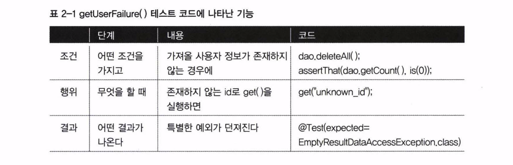

# 테스트가 이끄는 개발

새로운 기능을 추가할 때 테스트 코드부터 만들고 검증한 뒤 실제 코드에 적용하는 개발 전략이 있다. 많은 개발자가 이 방법을 적극적으로 사용하고 있다.

바로 이전에 `get()` 메소드의 예외 테스트를 떠올려보자. 새로운 기능을 위해 `UserDao`를 수정하고 `UserDaoTest`에서 테스트를 진행한 게 아니다. `UserDaoTest`에서 확인한 뒤에 `UserDao를` 수정했다.

구체적인 순서는 다음과 같았다.

### 1. 기능 결정

존재하지 않는 id로 `get()` 메소드를 실행하면 특정한 예외가 던져진다.

### 2. 테스트 메소드 구현

`getUserFailure()` 테스트 메소드를 만든다.

### 3. UserDao에 적용

요청한 id에 대한 `user` 데이터가 `null` 이면 예외를 발생시킨다.

---

이런 순서는 `만들어진 코드를 어떻게 테스트할까` 생각한 것이 아니라 `추가하고 싶은 기능을 코드로 표현`하려고 했기 때문에 가능한 것이다.

`getUserFailure()`에 나타난 기능을 정리해보면 마치 `기능 정의서` 처럼 보인다. 따라서 테스트는 `기능 설계 - 구현 - 테스트`라는 일반적인 흐름에서 `기능 설계` 부분을 일부 담당한다고 볼 수 있다.

이처럼 테스트는 설계한 대로 동작하는지 아닌지를 판단할 수 있는 작업이다. 코드 구현과 테스트라는 두 가지 작업이 동시에 끝나는 것이다.

## 테스트 주도 개발

원하는 기능을 추가하고 검증할 수 있도록 테스트 코드를 먼저 만들고 그 테스트가 성공할 수 있는 코드를 구현하는 방법이다. `테스트 우선 개발`이라고도 한다.

> 실패한 테스트를 성공시키기 위한 목적이 아닌 코드는 만들지 않는다.

실제 개발을 하다보면 정신이 없어 테스트 코드를 점검할 타이밍을 놓치는 경우가 많다. 문제는 코드를 만들고 나서 시간이 많이 지나면 테스트를 만들기가 귀찮아진다는 것이다.

TDD는 아예 테스트를 먼저 만들고 그 테스트가 성공하도록 코드를 만들기 때문에 테스트를 빼먹지 않고 꼼꼼하게 만들 수 있다.

테스트를 작성하고 이를 성공시키는 코드를 만드는 작업 주기는 가능한 `짧게` 가져가도록 권장한다. 테스트를 작성하고 실제 코드로 테스트 하는 일이 하루 종일 걸리면 안된다.

### TDD의 장점
#### 구현 및 테스트 시간 절감

이미 만들어둔 테스트 코드를 토대로 바로 실행할 수 있기 때문에 실제 구현 후 테스트 하는 시간이 대폭 줄어든다. 작은 단위로 쪼갠 단위 테스트 덕분에 빠르게 수정이 가능하다.

즉, 코드를 만들어 테스트를 실행하는 간격이 매우 짧아 오류에 쉽게 대응할 수 있다.

#### 작성한 코드에 대한 확신과 자신감 함양

테스트를 진행한 덕분에 피드백을 빨리 받을 수 있으며 코드에 대한 확신을 가질 수 있다.

> 눈물 젖은 커피와 함께 며칠간 밤샘을 하며 오류를 잡으려고 애쓰다가 전혀 생각지도 못한 곳해서 간신히 찾아낸 작은 버그 하나의 추억

이 말은 개발자가 진작에 충분한 테스트를 했었다면 쉽게 찾아냈을 것을 미루고 미루다 결국 커다란 삽질로 만들어버린 어리석은 기억일 뿐이다.