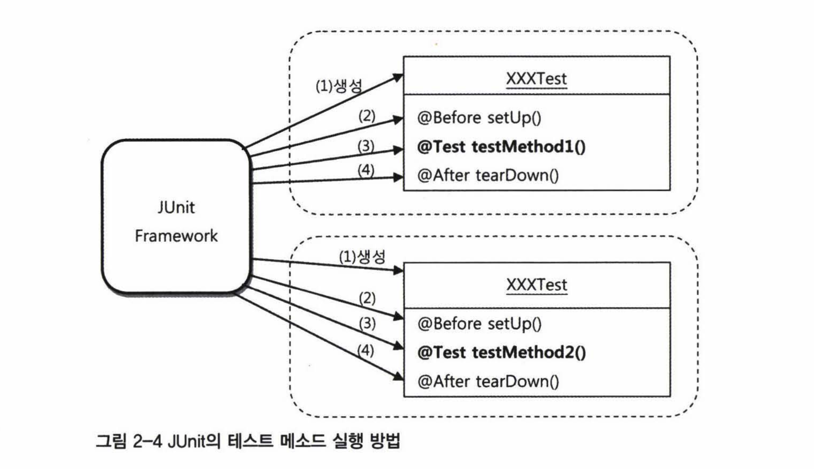

# 테스트 코드 리팩토링

테스트 결과가 일정하게 유지된다면 테스트 코드도 언제든지 리팩토링을 할 수 있다.

```java
public class UserDaoTest {
	
	@Test 
	public void andAndGet() throws SQLException {
		ApplicationContext context = new GenericXmlApplicationContext("applicationContext.xml");
        UserDao dao = context.getBean("userDao", UserDao.class);
        ...
	}
	
	@Test
	public void count() throws SQLException {
		ApplicationContext context = new GenericXmlApplicationContext("applicationContext.xml");
        UserDao dao = context.getBean("userDao", UserDao.class);
        ...
	}

	@Test
	public void getUserFailure() throws SQLException {
		ApplicationContext context = new GenericXmlApplicationContext("applicationContext.xml");
		UserDao dao = context.getBean("userDao", UserDao.class);
        ...
	}
}
```

`UserDaoTest`를 보면 중복되는 코드가 보인다. 중복된 코드는 메소드로 따로 뽑아내는 것이 제일 쉽다. 하지만 이번에는 JUnit이 제공하는 기능을 활용해보려고 한다.

## @Before 애노테이션

테스트 메소드를 실행하기 전에 먼저 실행시켜주는 기능이다.



```java
public class UserDaoTest {
    // setUp() 메소드에서 만드는 오브젝트를
    // 테스트 메소드에서도 사옹할 수 있도록 인스턴스 변수로 선언한다.
    private UserDao dao;

    // JUnit이 제공하는 애노테이션
    // @Test 메소드가 실행되기 전에 먼저 실행해야 하는 메소드를 정의한다.
    @Before
    public void setUp() {
        // 중복된 코드를 이곳으로 옮긴다.
        ApplicationContext context = new GenericXmlApplicationContext("applicationContext.xml");
        this.dao = context.getBean("userDao", UserDao.class);
    }
	
	@Test 
	public void andAndGet() throws SQLException {
		...
	}
	
	@Test
	public void count() throws SQLException {
        ...
	}

	@Test
	public void getUserFailure() throws SQLException {
        ...
	}
}
```



```java
public class UserDaoTest {
	
	@Test 
	public void andAndGet() throws SQLException {
		ApplicationContext context = new GenericXmlApplicationContext("applicationContext.xml");
		UserDao dao = context.getBean("userDao", UserDao.class);
        ...
	}
	
	@Test
	public void count() throws SQLException {
		ApplicationContext context = new GenericXmlApplicationContext("applicationContext.xml");
		UserDao dao = context.getBean("userDao", UserDao.class);
        ...
	}

	@Test
	public void getUserFailure() throws SQLException {
		ApplicationContext context = new GenericXmlApplicationContext("applicationContext.xml");
		UserDao dao = context.getBean("userDao", UserDao.class);
        ...
	}
}
```



JUnit 프레임워크는 어떤 과정을 거쳐 이 테스트를 수행하는 것일까? 프레임워크는 스스로 제어권을 가지고 동작하며 개발자가 만든 코드는 프레임워크에 의해 수동적으로 실행되므로 프레임워크의 흐름을 잘 이해해야 한다.

### 1. 테스트 메소드 검색

테스트 클래스에서 `@Test`가 붙은 `public`이고 `void`형이며 파라미터가 없는 테스트 메소드를 모두 찾는다.

### 2. 오브젝트 생성

테스트 메소드를 실행할 때마다 테스트 클래스의 오브젝트를 새로 만든다. 하나의 테스트 클래스 오브젝트는 테스트가 끝나면 버려진다. 

이렇게 하는 이유는 각 테스트가 서로 영향을 주지 않고 독립적임을 보장하기 위함이다. 따라서 인스턴스 변수도 초기화 되므로 부담 없이 사용할 수 있다.

### 3. @Before 처리

`@Before`가 붙은 메소드가 있다면 실행한다. 이 안에 들어있는 메소드는 JUnit이 자동으로 실행하므로 테스트 메소드에서 호출할 필요가 없다.

직접 호출하지 않으므로 서로 주고받을 정보나 오브젝트가 있다면 인스턴스 변수를 사용한다.

### 4. 테스트 메소드 호출

`@Test`가 붙은 메소드 하나를 호출하고 그 결과를 저장한다.

### 5. @After 처리

`@After`가 붙은 메소드가 있으면 실행한다. 역시 JUnit이 자동으로 실행한다.

직접 호출하지 않으므로 서로 주고받을 정보나 오브젝트가 있다면 인스턴스 변수를 사용한다.

### 6. 반복 수행

나머지 테스트 메소드에 대해 2~5번을 반복한다. 

### 7. 결과 도출

그동안 진행한 테스트의 모든 결과를 종합해서 돌려준다.



테스트 순서를 그림으로 나타내면 위와 같다. 만약 테스트 메소드의 일부에서만 공통적으로 사용하는 코드가 있다면 일반적인 메소드 추출 방법을 사용하면 된다. 아니면 아예 공통적인 특징을 지닌 테스트 메소드만 모아 별도의 테스트 클래스에 넣어도 된다.

## 픽스처

테스트를 수행하는 데 필요한 정보나 오브젝트를 `픽스처(fixture)`라고 한다. 여러 테스트에서 반복적으로 사용되기 때문에 `@Before` 메소드에 생성해두면 편하다.

```java
public class UserDaoTest {
    // 픽스처
    private UserDao dao;

    @Before
    public void setUp() {
        ApplicationContext context = new GenericXmlApplicationContext("applicationContext.xml");
        this.dao = context.getBean("userDao", UserDao.class);
    }

    @Test 
    public void andAndGet() throws SQLException {
        // User 오브젝트 생성이 중복됨
        User user1 = new User("gyumee", "박성철", "spring1");
		User user2 = new User("leegw700", "이길원", "spring2");
		
		dao.deleteAll();
		assertThat(dao.getCount(), is(0));

		dao.add(user1);
		dao.add(user2);
		assertThat(dao.getCount(), is(2));
		
		User userget1 = dao.get(user1.getId());
		assertThat(userget1.getName(), is(user1.getName()));
		assertThat(userget1.getPassword(), is(user1.getPassword()));
		
		User userget2 = dao.get(user2.getId());
		assertThat(userget2.getName(), is(user2.getName()));
		assertThat(userget2.getPassword(), is(user2.getPassword()));
    }
    
    @Test
    public void count() throws SQLException {
        // User 오브젝트 생성이 중복됨
		User user1 = new User("gyumee", "박성철", "spring1");
		User user2 = new User("leegw700", "이길원", "spring2");
		User user3 = new User("bumjin", "박범진", "spring3");
				
		dao.deleteAll();
		assertThat(dao.getCount(), is(0));
				
		dao.add(user1);
		assertThat(dao.getCount(), is(1));
		
		dao.add(user2);
		assertThat(dao.getCount(), is(2));
		
		dao.add(user3);
		assertThat(dao.getCount(), is(3));
    }

    @Test
    public void getUserFailure() throws SQLException {
		dao.deleteAll();
		assertThat(dao.getCount(), is(0));
		
		dao.get("unknown_id");
    }
}
```

`UserDaoTest`에서 사용하년 `dao` 변수가 대표적인 픽스처다. `dao.add(user)` 처럼 메소드에 전달하는 `User` 오브젝트도 픽스처라고 할 수 있다.

그런데 살펴보니 `getUserFailure()` 외의 테스트 메소드들은 모두 `add()`를 중복으로 사용하고 있다. User 오브젝트를 `@Before`에서 생성하도록 만들어보자.



```java
public class UserDaoTest {
    private UserDao dao;
    // 인스턴스 변수를 선언한 후
    private User user1;
    private User user2;
    private User user3;

    @Before
    public void setUp() {
        ApplicationContext context = new GenericXmlApplicationContext("applicationContext.xml");
        this.dao = context.getBean("userDao", UserDao.class);

        // @Before에 픽스처 생성 로직을 모아서 오브젝트를 생성한다.
		this.user1 = new User("gyumee", "박성철", "spring1");
		this.user2 = new User("leegw700", "이길원", "spring2");
		this.user3 = new User("bumjin", "박범진", "spring3");
    }
    @Test 
    public void andAndGet() throws SQLException {
		dao.deleteAll();
		assertThat(dao.getCount(), is(0));

		dao.add(user1);
		dao.add(user2);
		assertThat(dao.getCount(), is(2));
		
		User userget1 = dao.get(user1.getId());
		assertThat(userget1.getName(), is(user1.getName()));
		assertThat(userget1.getPassword(), is(user1.getPassword()));
		
		User userget2 = dao.get(user2.getId());
		assertThat(userget2.getName(), is(user2.getName()));
		assertThat(userget2.getPassword(), is(user2.getPassword()));
    }
    
    @Test
    public void count() throws SQLException {
		dao.deleteAll();
		assertThat(dao.getCount(), is(0));
				
		dao.add(user1);
		assertThat(dao.getCount(), is(1));
		
		dao.add(user2);
		assertThat(dao.getCount(), is(2));
		
		dao.add(user3);
		assertThat(dao.getCount(), is(3));
    }

    @Test
    public void getUserFailure() throws SQLException {
		dao.deleteAll();
		assertThat(dao.getCount(), is(0));
		
		dao.get("unknown_id");
    }
}
```



```java
public class UserDaoTest {
    private UserDao dao;

    @Before
    public void setUp() {
        ApplicationContext context = new GenericXmlApplicationContext("applicationContext.xml");
        this.dao = context.getBean("userDao", UserDao.class);
    }
    @Test 
    public void andAndGet() throws SQLException {
        User user1 = new User("gyumee", "박성철", "springno1");
		User user2 = new User("leegw700", "이길원", "springno2");
		
		dao.deleteAll();
		assertThat(dao.getCount(), is(0));

		dao.add(user1);
		dao.add(user2);
		assertThat(dao.getCount(), is(2));
		
		User userget1 = dao.get(user1.getId());
		assertThat(userget1.getName(), is(user1.getName()));
		assertThat(userget1.getPassword(), is(user1.getPassword()));
		
		User userget2 = dao.get(user2.getId());
		assertThat(userget2.getName(), is(user2.getName()));
		assertThat(userget2.getPassword(), is(user2.getPassword()));
    }
    
    @Test
    public void count() throws SQLException {
		User user1 = new User("gyumee", "박성철", "spring1");
		User user2 = new User("leegw700", "이길원", "spring2");
		User user3 = new User("bumjin", "박범진", "spring3");
				
		dao.deleteAll();
		assertThat(dao.getCount(), is(0));
				
		dao.add(user1);
		assertThat(dao.getCount(), is(1));
		
		dao.add(user2);
		assertThat(dao.getCount(), is(2));
		
		dao.add(user3);
		assertThat(dao.getCount(), is(3));
    }

    @Test
    public void getUserFailure() throws SQLException {
		dao.deleteAll();
		assertThat(dao.getCount(), is(0));
		
		dao.get("unknown_id");
    }
}
```

